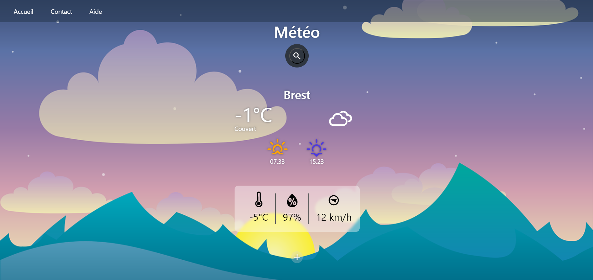
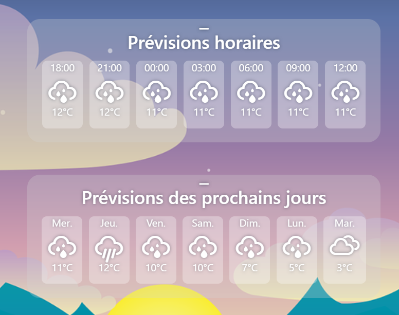
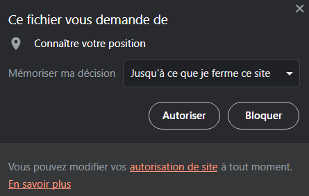
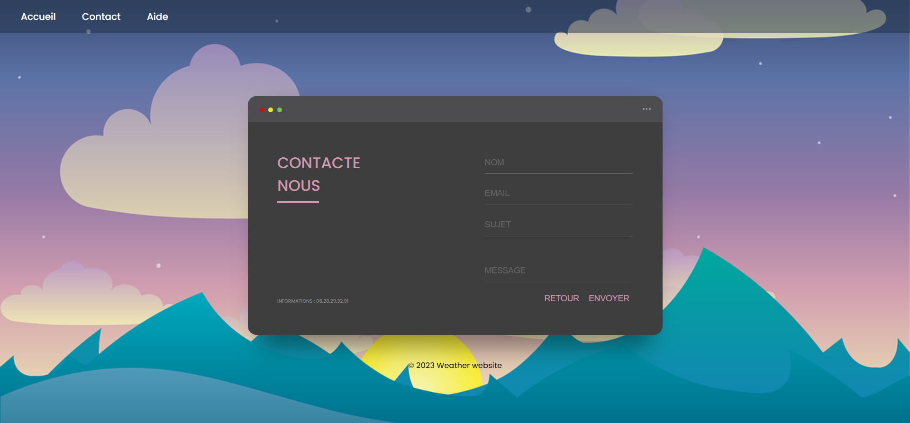

# R4.A.10 TP1 - Weather website
Tom Gourmelen
Damien Morice--Legouet

## Lancement de l'application
Afin de lancer l'application, vous devez d'abord extraire l'archive zip "src.zip".

Ensuite, vous devez copier le chemin d'accès vers le fichier "index.html", et rentrer ce chemin dans la barre de navigation de votre navigateur

Une fois cela fait, vous devriez normalement arriver sur la page d'accueil de notre application météo

## Utilisation de l'application
Sur la page d'accueil, vous devriez trouver un bouton de recherche.
Lorsque vous passez la souris sur ce bouton, un champ de texte apparait, et vous pouvez y rentrer le nom d'une ville.

Quand vous cliquez ensuite sur le bouton pour rechercher ou que vous appuyez sur la touche "entrée", des informations sur la météo de la ville renseignée apparaitront.

[Vidéo de démonstration](img/mov.mp4)

Vous retrouverez en haut : le nom de la ville, la température actuelle, la météo (nuageux, pluvieux, dégagé...) ainsi que l'heure du lever et du coucher de soleil.

Juste en dessous se trouvent la température ressentie, le taux d'humidité ainsi que la direction et la vitesse du vent.

En dessous de ces informations se trouvent deux boutons sur lesquels vous pouvez cliquer pour faire apparaitre les prévisions des prochaines heures et des prochains jours.

En gardant la souris sur tous ces éléments, vous aurez des informations sur le type de valeur dont il s'agit, et du jour ainsi que du temps pour les prévisions horaires et des prochains jours.

Pour que la recherche s'effectue bien, veuillez vous assurer d'être connecté à internet.

Les informations apparaitront seulement si la ville renseignée est trouvée.

## Présentation de chaque page

#### Page d'acceuil 

Dans cette page vous retrouverez les éléments importants que l'on souhaite généralement retrouver lorsque qu'on obtenir des informations concernant la météo.

#### Page des prévisions supplémentaires

Dans ces indications supplémentaires, on peut voir en détail les prévisions par heure et par jour.

#### Demande de localisation

La page demande d'accéder à la localisation de l'utilisateur pour connaître la météo directement à sa position.

#### Page contact

Enfin l'utilisateur à la posibilité, en cas de problème ou autre, de nous contacter (non fonctionnel) via un formulaire